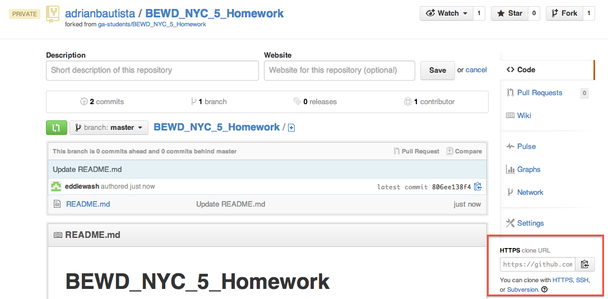
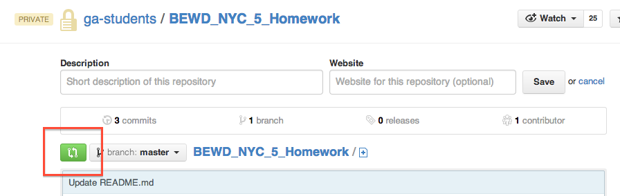
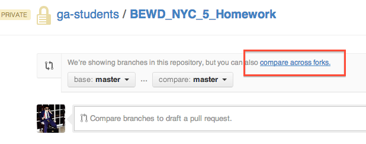

BEWD\_NYC\_5_Homework
===================

1. Fork this repo to your Github account
   
   
2. Clone the forked repo from your Github account
   
   
3. Create a folder named after you inside the "BEWD\_NYC\_5_Homework" folder
4. Touch a blank file inside your folder
5. Stage, commit and push your changes to your forked repo
6. Return to [the original homework repo](https://github.com/ga-students/BEWD_NYC_5_Homework)
7. Make a "Pull Request" from your forked repo to the original homework repo
   
   
   
8. Pat yourself on the back
